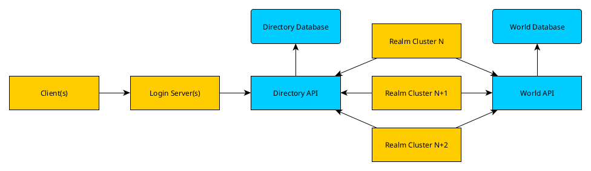
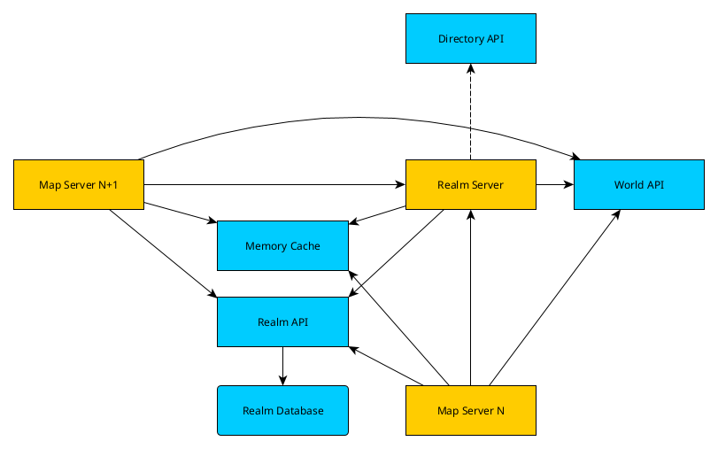
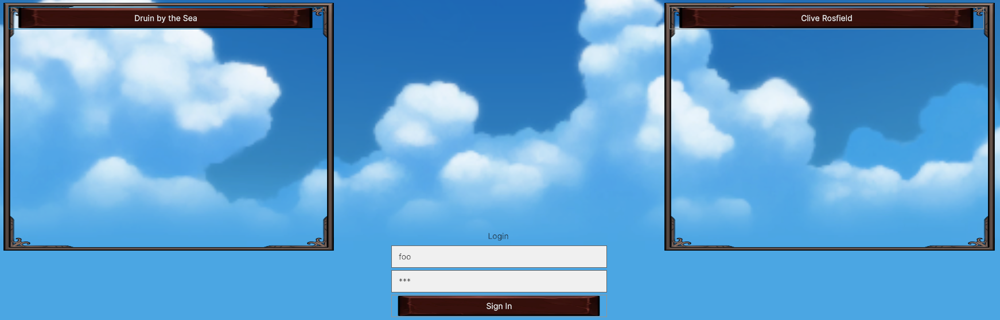
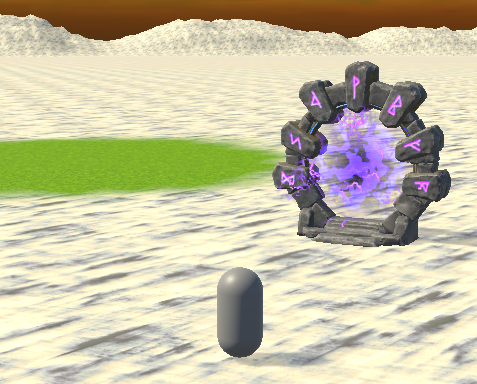
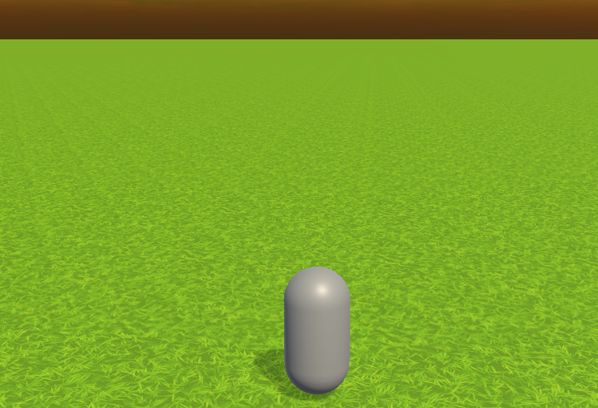
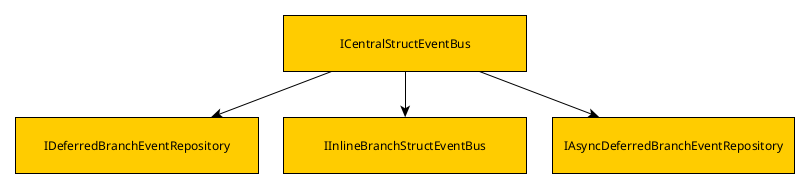

# "Adventure": Game Framework Research Project

This repository is an ongoing report on my research project. My project is aimed at making a framework and workflow that could potentially support a large-scale game such as an MMO.

## Why MMOs?

I've always wondered about the infrastructure behind large-scale games such as World of Warcraft. This fueled my own interest in game development, though my main field of work is not within games.

My career has pointed me towards developing a skillset that supports DevOps and microservices, so I wanted to see how I could apply those skills to this research project.

## Why a "Research Project"?

I chose to phrase this as a research project because the massive scope involved practically guaranteed that this project could never be completed. MMOs are complex and multifaceted projects requiring a wide range of skillsets, and a project completed by a single developer (even one working on the project full-time) is going to be an exceedingly rare thing.

If full completion is distant and unreachable, my questions become:

* How far *can* I take this project?
* How can I keep my structuring manageable? Not just of my main game engine project, but also all of the supporting projects?
* What would my infrastructure look like if I had to support a large number of players?

Instead of judging off of overall completion, I consider this project to be a success already because of the technical hurdles that I've already run into and figured out ways through. These solutions could be applied to multiple types of projects, not just an MMO framework.

## Architecture

### Main Builds

The game project itself is divided into 4 main builds:

* Client: User client
* Login: Entry point:
    * Authenticates the client's credentials and locates an account.
    * Provides the client with a list of available Realms.
    * Facilitates connection to Realms.
    * Could potentially have multiple login servers behind a load balancer.
* Realm: Central server to a server cluster instance
    * There can and should be multiple realm clusters to divide up a large playerbase
* Map: Hosts the game world for a given realm
    * Takes on the duties of handling the actual game world
    * Made because the realm is assumed to be the immediate bottleneck to supporting large numbers of players on a given realm.
    * There can be multiple Map servers supporting Realm, which is encouraged.

### Supporting Infrastructure

These main builds need supporting services and connective tissue. Some if the immediate considerations were:

* The supporting services should be flexible so that I can pivot my implementations if need be.
* For a project at this scale, at least one database technology will be required.
* To reduce game engine project complexity, no game project should communicate directly with a database. Database communication should instead go through APIs
* There might not be one definitive Login server, so communication between a Realm(s) and the Login server(s) should use an intermediate API as well
* The realm cluster servers should have common cache for use when transferring characters across maps.
* The Client is untrusted, so it should not have direct access to any internal APIs

These considerations led me to the following overall overall structure:



The structure within a realm cluster looks like this:



#### APIs

So far, I have defined the following APIs:

* Directory API
    * A proverbial phone book that serves/updates a list of available servers.
* World API
    * Contains global definitions for the world that are static across all realm clusters.
* Realm API
    * Contains realm-specific definitions such as character data.

## Technology

* APIs were written in AspNetCore, due to my familiarity with the framework from work.
* I chose Unity3D as my game engine due to its scripts being written in C#.
* Within Unity3D, I settled on [FishNet](https://assetstore.unity.com/packages/tools/network/fishnet-networking-evolved-207815) as my network implementation. I latched onto the concept of Broadcasts within FishNet being in line with my event bus plans (see below)

## Game Outcomes

The user is presented with a login screen. Upon logging in, they are presented with a list of realms populated by the directory API. Upon selecting a realm, they are given a list of characters populated by the realm API.



Upon selecting a character, the player is directed to a map server. The pictured portals (model credit: [AFS - Portals](https://assetstore.unity.com/packages/3d/props/exterior/afs-portals-321926)) are populated out of the world database via the world API.



Upon entering the portal, the player undergoes a map transfer to a second map server hosting a different world map.



## Hurdles and Innovations

### API Template

A key part of developing similar microservices is a template to easily spin up new instances. I developed [this](https://github.com/adeutscher/RedShirt.Example.Api) template to quickly spin up a basic AspNetCore API. The edge that this template has over a basic Visual Studio or Rider template is that it is set up with [NSwag](https://github.com/RicoSuter/NSwag). Nswag parses through the API's endpoints to generate an OpenAPI document, and then uses that API document to generate an interop project that can be exported as a NuGet package for other C# consumers.

### Event-Based Architecture

For this project, I had a few fundemental problems that were solve by introducing my own event bus implementation.

#### Problems

* My existing API template uses Swagger to describe my APIs and generate client code. While this automation is a net timesaver and error-preventer on its own, the methods themselves are all async.
* Other libraries may involve async code, such as libraries for safely storing API keys in a parameter store such as Vault or Amazon SSM.
* I did not want to spend resources spinning up a background thread for each API request.
* Once I had information from an API, acting on it (e.g. spawning an object) often needs to be done in a foreground thread due to the Unity engine.

#### Requirements

* An event bus that accepts both async and non-async handlers subscribing to events.
* To avoid bloated implementations, the handlers should able to leverage dependency injection.
* The foreground handler needs a time limit per update so as not to disrupt the rest of the foreground game loop.

#### Solution

The outcome of this was the [Utility.Events](https://github.com/adeutscher/RedShirt.Adventure.Utility.Events) library.



An event bus accepts any model that derives from a root interface definition.

The library has 3 options for handlers:

* Inline (Executed immediately)
* Non-Async (Executed by foreground thread)
* Async (Executed in background thread)

Example async handler:

```csharp
public class AsyncEventHandler : IAsyncBusEventHandler<AsyncEvent>
{
    public Task OnEventAsync(AsyncEvent @event, CancellationToken cancellationToken = new())
    {
        return Console.Out.WriteLineAsync($"Async Event: {@event.GetType().Name} handled by {GetType().Name}");
    }
}
```

##### Automation

One of the most frequent problems when debugging issues was forgetting to register a handler after listening, so I developed a series of methods that use reflection to detect the necessary handlers and register them for dependency injection and event handling.

Example:

```csharp
/*
 * A ServiceEnvelope contains a ServiceCollection
 *
 * The main benefit of making a ServiceEnvelope is to be able to
 * add callbacks that are run when the IServiceProvider is built.
 */
var serviceProvider = new ServiceEnvelope()
    // Add the main event bus to handle events that derive from IDemoEvent
    .ConfigureCentralStructEventBus<IDemoEvent>()
    // Detect all handlers, add them to dependency injection, and set a callback in the envelope to register
    // them in the event bus when the service provider is built.
    // See Extensions/ServiceEnvelopeExtensions in Utility.Event's example project for more information.
    .PrepEvents<IDemoEvent>(Assembly.GetExecutingAssembly(), [], [])
    .AddSingleton<IEventBusErrorHandler, ErrorHandler>()
    // Services used by handlers still need to be added to dependency injection
    .AddSingleton<IExampleService, ExampleService>()
    // Build service provider
    .BuildServiceProvider();
```

### Dapper Database Helper

#### Problem

I lean towards using Dapper in my database work to allow for more precise control over queries. When developing APIs, this preference became slightly impractical for this project for a number of reasons:

* Dealing with a large number of new tables
* New tables have a large number of individual columns.
* New tables weren't necessarily set in stone
* Large number of basic CRUD queries/commands made for slow turnaround with multiple queries.

#### Solution

In order to not split between two database libraries, I created a base class that would perform my own custom object mapping ([link](https://github.com/adeutscher/DapperDatabaseHelper)). It's a step towards EntityFramework in that it automatically constructs queries for me, but on my own terms.

### HTTP Server

#### Problem

While not pictured in my architecture diagram, it wouldn't be out of the question for other microservices to need to reach out to contact the main game servers. For example:

* Delivering messages to a player
* Pulling live information on in-game elements (more up-to-date than where they are in the database)

#### Solution

Rather than figure out how to make every type of service aware of how to communicate over my chosen network implementation, I opted to go for HTTP as common ground. I found an example of a basic HTTP server written by David Jeske and adapted it for use in Unity.

```csharp
private class ToastEndpoint : IHttpEndpoint
{
    public HttpMethod Method => HttpMethod.Post; // A PUT might be better, but it's only a demo and it rhymes!
    public string Path => "/toast";

    public HttpResponseMessage Handle(string body, Dictionary<string, string> parameters,
        Dictionary<string, string> headers)
    {
        ToastRegionScript.Instance.Add($"HTTP Message: {body}");
        var response = new HttpResponseMessage
        {
            StatusCode = HttpStatusCode.Accepted
        };
        return response;
    }
}
```

##### Validators

Though the main request is handled in the main thread, the HTTP server also supports async methods for validators. This could be used for API key validation.

## Near-Future Hurdles

Being a research project of infinite scope, there will never be a shortage of ToDo items. However, these are some immediate examples of where I might take the project in the near future:

* Experimenting with different transport implementations within FishNet.
* Assigning more properties to a character object
* Saving a character's data back to the database via the API
* Developing a rough UI framework to support something like a logout button.
* Applying the `Utility.Events` library to a more tightly-scoped project.