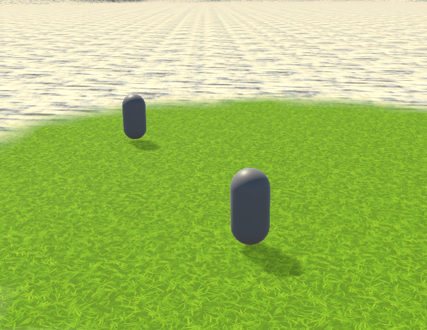
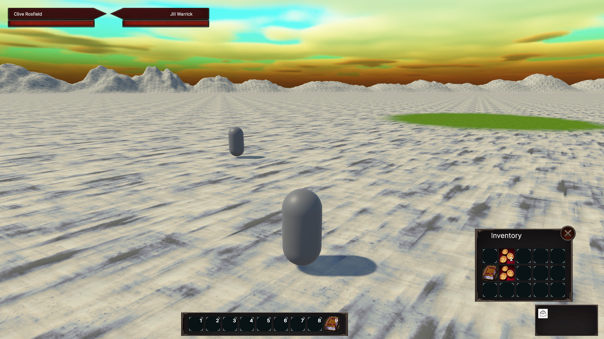

# "Adventure": Game Framework Research Project

This repository is an ongoing report on my research project. My project is aimed at making a framework and workflow that could to support a networked RPG.

## Why RPGs?

I've always wondered about the infrastructure behind large-scale RPG games such as World of Warcraft. This fueled my own general interest in game development, though my main field of work has been within supporting a SaaS platform.

My career has pointed me towards developing a SaaS skillset that supports APIs, microservices, and DevOps. I wanted to see how I could apply those skills to this research project.

## Why a "Research Project"?

I chose to phrase this as a research project because the massive scope involved practically guaranteed that this project could never be completed as a solo project. Networked RPGs like MMOs are complex and multifaceted projects requiring a wide range of skillsets, and a project completed by a single developer (even one working on the project full-time) is going to be an exceedingly rare thing.

If full completion is distant and unreachable, my questions become:

* How far *can* I take this project?
* How can I keep my structuring manageable? Not just of my main game engine project, but also all of the supporting projects?
* What would my infrastructure look like if I had to support a large number of players?

Instead of judging off of overall completion, I consider this project to be a success already because of the technical hurdles that I've already run into and figured sustainable solutions for. These solutions could be applied to multiple types of projects, not just an RPG framework.

## Organization

The broad goal of making a game platform such as for an MMO is ambitious, to say the least. In order to make progress on this goal it was necessary to break down the project into manageable individual pieces. To accomplish this, I planned out my project as though it were for an agile team. Epics represented broad goals for a feature, user stories a stage towards that goal, and individual tasks describing more granular efforts towards that stage (usually drawn along code repository lines). Being a personal project, I designated each month as a sprint rather than setting up a specific cadence.

## Architecture

The architecture for this project was made with two key ideas in mind:

* A networked RPG lives on being scalable. The architecture must be built so that there there is more than one game server involved to distribute workload.
* The second point is focused on my goal of structuring this project as though it could be scaled to be a team effort. Modern game engines accelerate development to make this project remotely viable, but modern game engines come with complexity and possible licensing costs. On top of this, it shouldn't be a requirement to have knowledge of a game engine for someone to contribute to the framework. Information storage should be removed from the game engine as much as possible, and tools should be made to manipulate the data. The game server(s) and client should be just the last stop along this pipeline.

### Main Builds

The game project itself is divided into 4 main builds:

* Client: User client
* Login: Entry point:
    * Authenticates the client's credentials and locates an account.
    * Provides the client with a list of available Realms.
    * Facilitates connection to Realms.
    * Could potentially have multiple login servers behind a load balancer.
* Realm: Central server to a server cluster instance
    * There can and should be multiple realm clusters to divide up a large playerbase
* Map: Hosts the game world for a given realm
    * Takes on the duties of handling the actual game world
    * Made because the realm is assumed to be the immediate bottleneck to supporting large numbers of players on a given realm.
    * There can be multiple Map servers supporting a given Realm, which is encouraged.

Building on this, nothing prevents there from being additional supporting servers that the Map servers rely on as they do the Realm. There isn't any need for that at the moment, however.

### Supporting Infrastructure

These main builds need supporting services and connective tissue. Some if the immediate considerations were:

* The supporting services should be flexible so that I can pivot my implementations if need be.
* For a project at this scale, at least one database technology will be required.
* To reduce game engine project complexity, no game project should communicate directly with a database. Database communication should instead go through APIs.
* There might not be one definitive Login server, so communication between a Realm(s) and the Login server(s) should use an intermediate API as well
* The realm cluster servers should have common cache for use when transferring characters across maps.
* The Client is untrusted, so it clearly should not have direct access to any internal APIs.

These considerations led me to the following overall overall structure:


The structure within a realm cluster looks like this:


#### APIs

So far, I have defined the following APIs:

* Directory API
    * A proverbial phone book that serves/updates a list of available servers.
    * Used by Login and Realm servers.
* World API
    * Contains global definitions for the world that are static across all realm clusters.
    * Used by Realm and Map servers.
* Realm API
    * Contains realm-specific definitions such as character data.
    * Used by Realm and Map servers.

## Technology

* APIs were written in ASP.NET Core, due to my familiarity with the framework from work.
* I chose Unity3D as my game engine due to its scripts being written in C#.
* Within Unity3D, I settled on [FishNet](https://assetstore.unity.com/packages/tools/network/fishnet-networking-evolved-207815) as my network implementation. In particular, I latched onto the concept of Broadcasts within FishNet being in line with my event bus plans (see below)
* All of the infrastructure is containerized, and local testing is done through `docker compose`.
* Infrastructure is managed through Terraform. The main focus for the moment is just on making things work locally, so for the moment this is just for defining repositories and build pipelines for NuGet packages.

## Game Outcomes

The user is presented with a login screen. Upon logging in, they are presented with a list of realms populated by the directory API. Upon selecting a realm, they are given a list of characters populated by the realm API.


Upon selecting a character, the player is directed to a map server. The pictured portals (model credit: [AFS - Portals](https://assetstore.unity.com/packages/3d/props/exterior/afs-portals-321926)) are populated out of the world database via the world API.


Upon entering the portal, the player undergoes a map transfer to a second map server hosting a different world map.


Multiple players are able to connect to the server and see each other:



I have implemented a basic inventory UI and spell bar:



## Hurdles and Innovations

This section documents hurdles some noteworthy hurdles that I encountered and how I worked around them. For ponderings on some in-progress hurdles that haven't quite been cleeared, see the [Adventure.Planning](https://github.com/adeutscher/Adventure.Planning) repository.

### API Template

A key part of developing similar microservices is a template to easily spin up new instances. I developed [this](https://github.com/adeutscher/RedShirt.Example.Api) template to quickly spin up a basic AspNetCore API. The edge that this template has over a basic Visual Studio or Rider template is that it is set up with [NSwag](https://github.com/RicoSuter/NSwag). Nswag parses through the API's endpoints to generate an OpenAPI document, and then uses that API document to generate an interop project that can be exported as a NuGet package for other C# consumers.

### Event-Based Architecture

For this project, I had a few fundemental problems that were solve by introducing my own event bus implementation.

#### Problems

* My existing API template uses Swagger to describe my APIs and generate client code. While this automation is a net timesaver and error-preventer on its own, the methods themselves are all async.
    * I could set a configuration option to generate sync methods, but async is preferred. It also wouldn't be advisable to make HTTP calls that could take several milliseconds at best in the foreground thread.
* Other libraries may involve async code, such as libraries for safely storing API keys in a parameter store such as Vault or Amazon SSM. Unlike NSwag, there's not necessarily an option to enable sync methods for these ones.
* I did not want to spend resources spinning up a background thread for each individual API request.
* Once I had information from an API, acting on it (e.g. spawning an object) often needs to be done in a foreground thread due to the Unity engine.

#### Requirements

* An event bus that accepts both async and non-async handlers subscribing to events.
* To avoid bloated implementations, the handlers should able to leverage dependency injection.
* The foreground handler needs a time limit per update so as not to disrupt the rest of the foreground game loop.

#### Solution

The outcome of this was the [Utility.Events](https://github.com/adeutscher/RedShirt.Adventure.Utility.Events) library.


An event bus accepts any model that derives from a root interface definition.

The library has 3 options for handlers:

* Inline (Executed immediately)
* Non-Async (Executed by foreground thread)
* Async (Executed in background thread)

Example async handler:

```csharp
public class AsyncEventHandler : IAsyncBusEventHandler<AsyncEvent>
{
    public Task OnEventAsync(AsyncEvent @event, CancellationToken cancellationToken = new())
    {
        return Console.Out.WriteLineAsync($"Async Event: {@event.GetType().Name} handled by {GetType().Name}");
    }
}
```

Most communication within the servers and clients is done through this library.

#### Spawning Objects

See [here](./spawning.md) for more information on spawning objects through the event system.

##### Automation

One of the most frequent problems when debugging issues was forgetting to register a handler after listening, so I developed a series of methods that use reflection to detect the necessary handlers and register them for dependency injection and event handling.

Example:

```csharp
/*
 * A ServiceEnvelope contains a ServiceCollection
 *
 * The main benefit of making a ServiceEnvelope is to be able to
 * add callbacks that are run when the IServiceProvider is built.
 */
var serviceProvider = new ServiceEnvelope()
    // Add the main event bus to handle events that derive from IDemoEvent
    .ConfigureCentralStructEventBus<IDemoEvent>()
    // Detect all handlers, add them to dependency injection, and set a callback in the envelope to register
    // them in the event bus when the service provider is built.
    // See Extensions/ServiceEnvelopeExtensions in Utility.Event's example project for more information.
    .PrepEvents<IDemoEvent>(Assembly.GetExecutingAssembly(), [], [])
    .AddSingleton<IEventBusErrorHandler, ErrorHandler>()
    // Services used by handlers still need to be added to dependency injection
    .AddSingleton<IExampleService, ExampleService>()
    // Build service provider
    .BuildServiceProvider();
```

### API Automation

#### Problem 1

I lean towards using Dapper in my database work to allow for more precise control over queries. When developing APIs, this preference became slightly impractical for this project for a number of reasons:

* Dealing with a large number of new tables
* New tables could have a large number of individual columns.
* Large number of basic CRUD queries/commands made for slow turnaround with multiple queries.
* New tables weren't necessarily set in stone. Investing time in making these had an impact on both project velocity and morale.

These problems are not entirely tied to my use of Dapper. Even if I were using an established ORM such as Entity Framework, I would need to come up with implementations to translate API requests into actionable queries.

#### Solution 1 (Dapper Database Helper)

In order to not split between two database libraries, I created a base class that would perform my own custom object mapping. It's a step towards an ORM such as Entity Framework in that it automatically constructs queries for me, but on my own terms.

The Dapper Database Helpers were originally published as their own project ([link](https://github.com/adeutscher/DapperDatabaseHelper)), but have since been rolled into the [Example API Template](https://github.com/adeutscher/RedShirt.Example.Api/) as a subproject ([link](https://github.com/adeutscher/RedShirt.Example.Api/tree/develop/src/RedShirt.Example.Api.DataStores.Common.DapperMySql)).

#### Problem 2

The custom object mapping in Dapper was a step in the right direction for speed, but it still left a lot of overhead to do:

* Each table needs a service layer to implement business logic.
* Each table repository needs its own search implentation. Custom object mapping was never made to cover the search feature.
* Though the services and repositories are similar to one another, copy-pasting them creates drift and eventual inconsistency between implementation.
* I began to pivot towards smaller, normalized database tables describing attributes of a subject rather than one large table. This multiplied these problems by creating a demand for many tables at once.
* As with my original problem, implementation of these tables still took time.

#### Solution 2 (Deterministic Source Generators)

The solution to this problem was to implement a deterministic [Source Generator](https://devblogs.microsoft.com/dotnet/introducing-c-source-generators/). Implementing a source generator allowed me to build entire service classes and repositories off of a single data type declaration.

I made some aspects of the source generation configurable by way of control attributes. For example, if the specific demands of a service layer were off-spec then I could disable service generation and use the previous generated code as a convenient baseline to implement custom requirements.

Doing this with deterministic source generation meant that fewer individual changes needed to be implemented and reviewed. A modern alternative might be to accelerate development on an endpoint using AI tooling, but even with a perfectly-curated set of guidelines to generate the repository and service layers the larger amount of output would still be subject to human review for possible errors. A tailor-made approach based on a deterministic system is more reliable for consistency than a probabilistic system.

Source generation can also be found in the [API template](https://github.com/adeutscher/RedShirt.Example.Api): [RedShirt.Example.Api.DataStores.Analyzers.DapperMySql.Generation](https://github.com/adeutscher/RedShirt.Example.Api/tree/develop/src/RedShirt.Example.Api.DataStores.Analyzers.DapperMySql.Generation)

### HTTP Server

#### Problems

* The baseline server lacks debug utilities.
* While not pictured in my architecture diagrams, it wouldn't be out of the question for other microservices to need to reach out to contact the main game servers. For example:
    * Delivering messages to a player
    * Pulling live information on in-game elements (more up-to-date than where they are in the database)

#### Solution

Rather than figure out how to make every type of service aware of how to communicate over my chosen network implementation, I opted to go for HTTP as common ground. I found an example of a basic HTTP server written by David Jeske and adapted it for use in Unity.

```csharp
private class ToastEndpoint : IHttpEndpoint
{
    public HttpMethod Method => HttpMethod.Post; // A PUT might be better, but it's only a demo and it rhymes!
    public string Path => "/toast";

    public HttpResponseMessage Handle(string body, Dictionary<string, string> parameters,
        Dictionary<string, string> headers)
    {
        ToastRegionScript.Instance.Add($"HTTP Message: {body}");
        var response = new HttpResponseMessage
        {
            StatusCode = HttpStatusCode.Accepted
        };
        return response;
    }
}
```

My adaptation of the HTTP server can be found here: [BasicHttpServer](https://github.com/adeutscher/BasicHttpServer)

##### Practical Application

A series of endpoints are currently being leveraged to simplify debugging of Map servers. These debug endpoints are configurable so that they can be turned off entirely outside of a development environment.

Examples of some initial scripts:

* List active map instances on a Map server.
* List active player characters on a Map server.
* List active Portal resources on a Map server.
* Teleport a particular player character (either within the same map instance or to another map instance)
* Dynamically update the location/configuration of database-driven Portal resources.

##### Validators

Though the main request is handled in the main thread, the HTTP server also supports async methods for validators. This could be used for API key validation.

### Other

Other minor things that I think are neat:

* Within the API template, I like [this little snippet](https://github.com/adeutscher/RedShirt.Example.Api/blob/develop/src/RedShirt.Example.Api/Extensions/ConfigurationBuilderExtensions.cs) a lot. I have a version in each of my templates, and it's a massive help in keeping environment options straight in a containerized environment.
* Migrating to using [syslog](https://github.com/emertechie/SyslogNet) to log in a structured way. Using [syslog-rfc5424](https://github.com/EasyPost/syslog-rfc5424-parser) as a receiver.

## The Uncommercializable Game

As it stands, I don't believe that this hobby project will ever be directly able to be commercialized as a solo operation. The central reason for this is again that networked RPGs, and especially MMOs, are massive undertakings.

On top of being the sole system developer, below are just a few of the different hats that one would have to juggle in order to make the game run smoothly:

* Community Manager
* Game Master
* Financial Manager
* Content Designer (within the existing framework, to say nothing of coding new features)
* Legal (and I am not a lawyer)

As the sole developer, putting on one hat would bring progress on the other hats more or less to a screeching halt. In order to operate at any scale, delegation and collaboration with others required.

### A Middle Path

A possible middle ground I've considered is making the game available online and setting up a KoFi or similar to support the hosting costs. However, this requires having an actual game to release. The framework is a __*long*__ way from being in a state where I'd feel comfortable even attempting this. So hosting and any sort of public release are a distant ambition for the foreseeable future.

### The Silver Lining

All that being said, the situation has upsides. Above all else, this project is an excellent learning opportunity for me. With every new feature, I learn new things about game development and Unity to better implement my plans.

The project can yield more than experience as well. I like to view this project as a structure of LEGO bricks. The proverbial bricks are currently being built into a networked RPG, but they can also be repurposed into more tightly-scoped game projects that can be released without the same infrastructure demands.

## Near-Future Hurdles

Being a research project of infinite scope, there will never be a shortage of ToDo items. However, these are some immediate examples of where I might take the project in the near future:

* Experimenting with different transport implementations within FishNet.
* Assigning more properties to a character object.
* Developing a rough UI framework to support something like a logout button.
* Applying the `Utility.Events` library to a more tightly-scoped project.
