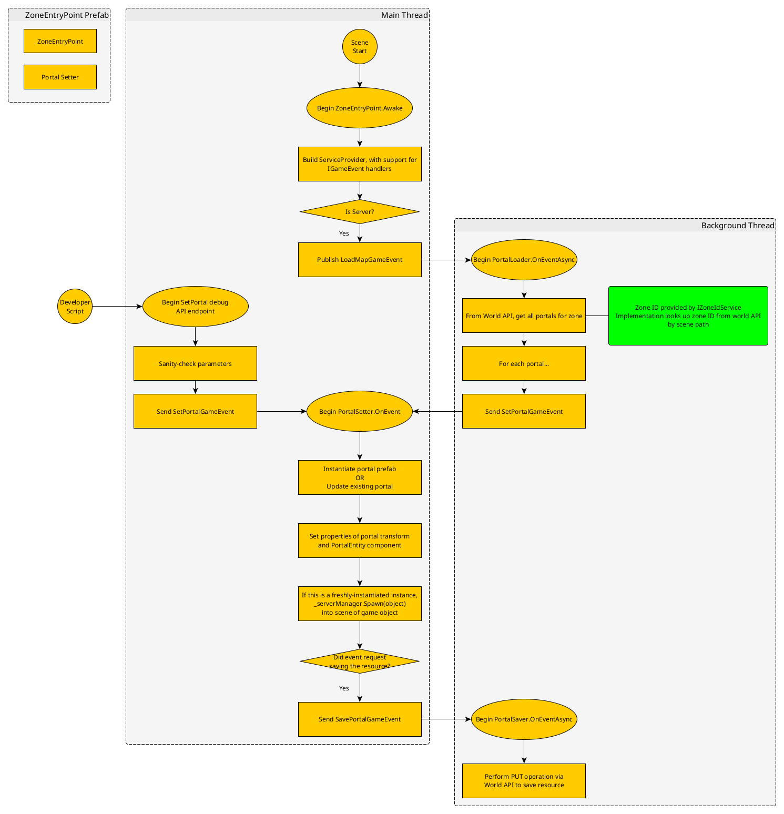

# Spawning

## Portals

Portals were the first objects defined in the World database to be manifested into the game world, so for now they set the standard on how such resources should be structured.

### Initialization

1. Each map is outfitted with a "entry point" prefab object containing a `ZoneEntryPoint` component.
2. The `LoadMapGameEvent` is the kick-off event sent when the `ZoneEntryPoint.Awake` method on the server is about to finish.
3. Any number of different loaders should subscribe to `LoadMapGameEvent`. Since these loaders need to poll the World API and could involve delays, they should run in the background in order be handled by an `async` method.
4. The loaders pull information on each instance of a Portal for the current map from the world API.
5. For each Portal, send a `SetPortalGameEvent`
6. A `SetPortalGameEvent` is handled by a `PortalSetter`. In order to have knowledge of which scene it's working in, the `PortalSetter` is a component that is part of the entry point prefab. Since spawning a portal involves instantiating objects in the scene, this handler must be run in the foreground.

### Setting Iteration

When the object was solely initialized at the start of the map, it was a miserable process to debug. Because of this, I leveraged the internal HTTP server to create a debug endpoint that would upsert portals into the game world. When the debug endpoints are enabled, it allows a developer to rapidly iterate on object settings. Like with the initialization flow, the endpoint sends a `SetPortalGameEvent` so that the portal-setting logic is centralized.

The `SetPortalEvent` also has the option to save information back to the database.

### Diagram

The below diagram demonstrates both flows of how an object can be loaded into the game:

